# Questions - 

## Question 1 - 

> What do you mean by b-value as a seismological aspect? Write the Gutenber-Richter Relationship and describe its importance in seismology.

## Question 2 - 

> Briefly sketch the Geological settings of the Andaman and describe its Seismic history.

## Question 3 - 

> Illustrate the b-value of the study area and crave out the potential hazardous region on the basis of spatial and temporal variations of b-value

# Answers

## Answer 1-

One of the basic seismological parameters used to describe an ensemble of earthquakes is the *b-value* in the famous Gutenberg-Richter frequency magnitude relationship relationship/law. 

It charaterizes the distribution of earthquakes over the observed range of magnitudes. The *b-value* is usually 1.0, but for shorter time windows it varies significantly depending on the tectonic features of the seismically active region [@prasad2015evolution] [@pacheco1992changes]. In order to understand the concept of b-value in terms of seismology, we first need to understand the Guteneberg Richter law and its significance -

**Gutenberg-Richter Law ~**

> In seismology, the Gutenberg–Richter law (GR law) expresses the relationship between the magnitude and total number of earthquakes in any given region and time period of at least that magnitude. [@gutenberg1956energy]

The corresponding Gutenberg-Richter Frequency Magnitude Relation is given by, 

$$\log_{10}{N} = a - bM$$

Or

$$N = 10^{a - bM}$$

Where, $N$ is the number of events having a magnitude $\geq M$, also called the cumulative Frequency, and $a$ and $b$ are constants which are always same for a given value of $N$ and $M$.

The significance of the GR law lies in the values of these constants. The relationship between earthquake magnitude and frequency is fairly common, but the values of $a$ and $b$ vary significantly from region to region giving seismologists significant amount of information regarding the seismo-tectonics/geo-tectonics of the region under study. When we say that the parameter $b$ i.e. the *b-value* is close to the value 1.0 (in seismically active regions)we mean to say that for a given frequency say 4.0 or larger events there will be 10 times as many magnitude 3.0 or larger quakes and also 100 times as many magnitude 2.0 or larger quakes. But the *b-value* can vary significantly from 0.5 to 2.0 or even higher depending upon on the region's seismic activity. A good example of this is Earthquake swarms which can have a *b-value* as high as 2.5 which indicates a high proportion of small quakes to large ones.

The GR Law and specifically the measurement and interpretation of the spatial and temporal variations in *b-values* can provide significant information about the evolution of the seismicity of the region under study. By analysing anomalies in the spatio-temporal variation in the *b-value* of a region with respect to major quakes we can obtain spatio-temporal constraints that can used to create, modify and/or improve earthquake forecasting models for that particular region as done by Nuannin et. al. [@nuannin2005spatial] for the Andaman-Sumatra region.

According to some recent work, the major anomalies that lead to these spatio-temporal variations have been: 

- the stress applied to the material, 
- the depth, the focal mechanism, 
- the strength heterogeneity of the material and the proximity of macro-failure. 

These variations in b-value decrease were observed prior to the failure of rock samples which were deformed in the laboratory and it leads to the suggestion that this is a precursor to major macro-failure and ultimately large magnitude eathquakes. [@smith1981b]

Now, a deviation of *b-value* from the value 1.0 can also be due to some inconsistency in the data set, i.e. it might be incomplete or it might contain errors propogated in the calculation of magnitude.

There is an apparent b-value decrease for smaller magnitude event ranges in all empirical catalogues of earthquakes. This effect is described as "roll-off" of the b-value, a description due to the plot of the logarithmic version of the GR law becoming flatter at the low magnitude end of the plot. This may in large part be caused by incompleteness of any data set due to the inability to detect and characterize small events. That is, many low-magnitude earthquakes are not catalogued because fewer stations detect and record them due to decreasing instrumental signal to noise levels. Some modern models of earthquake dynamics, however, predict a physical roll-off in the earthquake size distribution.[@bhattacharya2009fractal]

Now, the ***a-value*** represents the total seismicity rate of the region. This is more easily seen when the GR law is expressed in terms of the total number of events: 

$$N = N_{TOT}10^{-bM}$$

where $N_{TOT} = 10^a$, is the total number of events. Also it is interesting to note that since $10^a$ is the total number of events, $10^{-bM}$ is the probablity of those events.

## Answer 2-

**Geological Setting of the Andaman Region**

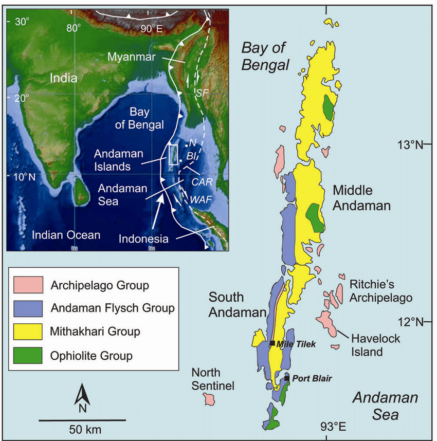

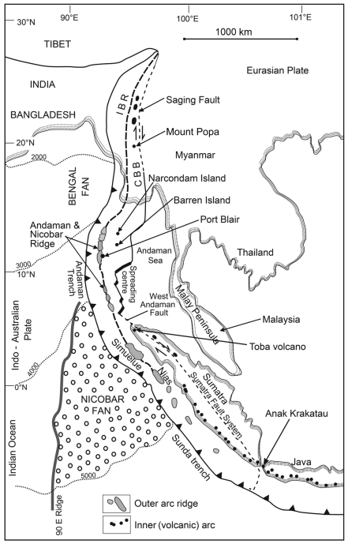

Figure 2 shows the major present-day morphotectonic elements including Andaman–Nicobar accretionary ridge(modified after Curray 2005)

The Andaman Region is an active, complex backarc basin lying above and behind the Sunda subduction zone where convergence between the overriding Southeast Asian plate and the subducting Australian plate is highly oblique. The tectonics and geological history of the Andaman Sea cannot be separated from the tectonics and geological histories of Myanmar (Burma) on the north, the Andaman and Nicobar Islands part of the accretionary prism on the western side of the Andaman Sea, and Sumatra on the south.and Nicobar Islands part of the accretionary prism on the western side of the Andaman Sea, and Sumatra on the south.[@curray2005tectonics]

The Andaman–Nicobar archipelago that forms the western margin of the Andaman Sea is a sediment-dominated accretionary wedge (outer-arc island) associated with a convergent margin tectonic setting. The Andaman accretionary ridge consists of two stratigraphically and structurally distinct terranes, juxtaposed and telescoped into a north–south-trending high-relief fold-thrust belt formed along the obliquely subducting eastern margin of the Indo-Australian oceanic lithospheric plate. [@bandopadhyay2017geological] The geology and structure of the ridge reflect the complexity of the evolving tectonics and stratigraphy of an accretionary wedge. [@curray2005tectonics]

The Andaman– Nicobar Islands are part of a 5600 km long curvilinear belt of accretionary ridges and outer-arc islands that stretches from Sumba in Eastern Indonesia to Western Burma in the north associated with the subduction of Indo-Australian oceanic lithosphere below an overriding Eurasian (Sunda) Plate

In an accretionary setting new material is progressively accreted to the thin outer end of the accretionary wedge, while the oldest and thickest inner part of the accretionary wedge near the inner trench wall may be thickened further, increased in volume by underplating and consequently uplifted and exposed to form a chain of fold-thrust belt islands

**Seismic History of the Andaman region**

- Earthquake History

The map given in the Figure 3 on page 6 shows all historically recorded earthquakes in the Andaman & Nicobar Islands from the year 1980 to 2020. Two prominent red circles visible to the north-east of Port Blair, i.e. in the top half of the map, are where the only volcanoes in India are located. The northernmost of the is the Barren Island Volcano. This volcano has erupted in recent times. The other volcano is called Narcondam and is dormant. The Andaman and Nicobar Islands are located near the boundary of the Indian plate and the Burmese Microplate. The Andaman Trench marks this boundary and lies in the Bay of Bengal to the west of the archipelago. Another prominent feature is the north-south West Andaman fault which is strike-slip in nature and lies in the Andaman Sea, to the east of this island chain. The Andaman Sea, just like the Atlantic Ocean, is presently being widened by a tectonic process called "Sea Floor spreading". This is taking place along undersea ridges on the seafloor. The Indian plate is diving beneath the Burmese Microplate along the Andaman Trench in a process known as "Subduction". Shallow and occasional intermediate-depth earthquakes delineate the subducted slab under the Andaman-Nicobar islands joining the seismicity trend of the Indo-Burman ranges. However, it must be stated that proximity to faults does not necessarily translate into a higher hazard as compared to areas located further away, as damage from earthquakes depends on numerous factors such as subsurface geology as well as adherence to the building codes.

Figure 4 on page 7 is a scatter plot of the cumulaticve data set with the y-axis indicating the magnitude and the x-axis showing the index number of the corresping magnitude. Three of the highest magnitude earthquakes having $M_{b} = 6.3$ and $6.2$ have been marked with the respective dates on the graph.

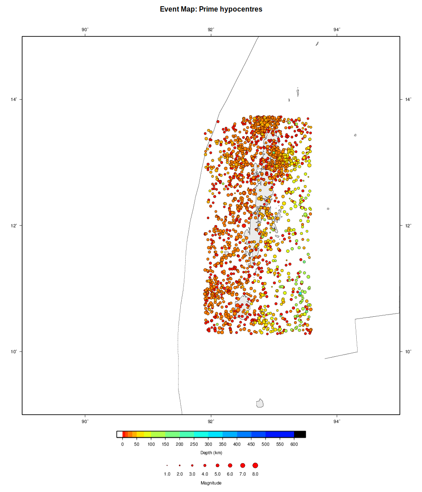

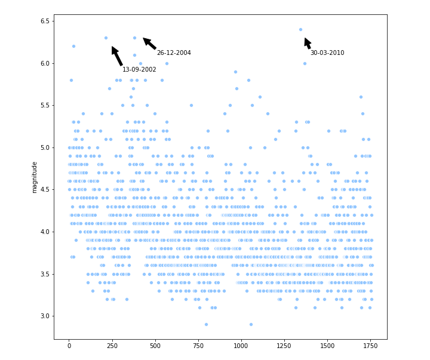

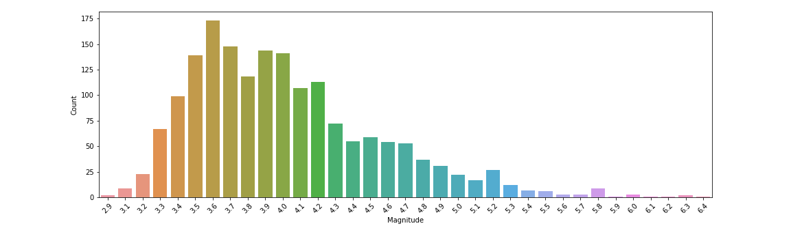

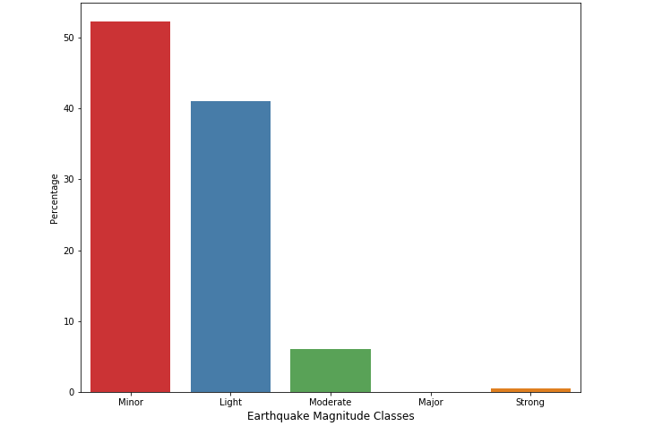

Figure 5 on page 7 gives the Magnitde count of the eathquakes i.e. the number of earthquakes that occured in the Andaman region between the years 1980 and 2020 for each recorded magnitude scale.

Figure 6 above shows the number of earthquakes that occured for the following defined magnitude classes -

- $3.0 \leq m_b \leq 3.9 \rightarrow$ **"Minor"**;
- $4.0 \leq m_b \leq 4.9 \rightarrow$ **"Light"**;
- $5.0 \leq m_b \leq 5.9 \rightarrow$ **"Moderate"**;
- $6.0 \leq m_b \leq 6.9 \rightarrow$ **"Strong"**;
- $7.0 \leq m_b \leq 7.9 \rightarrow$ **"Major"**;
- Else $\rightarrow$ **"Great"**.

Figure 7 on page 9 shows the Annual Frequency distribution of the earthquakes in the Andaman region. The code for the given data analysed and visualised here, is available at the end of the assignemnt.

The Andaman Region whose data has been visualised has the following coordinates-

- Top Latitude $\rightarrow 13.734^{o}$
- Bottom Latitude $\rightarrow 10.275^{o}$
- Left Longitude $\rightarrow 91.901^{o}$
- Right Longitude $\rightarrow 93.593^{o}$

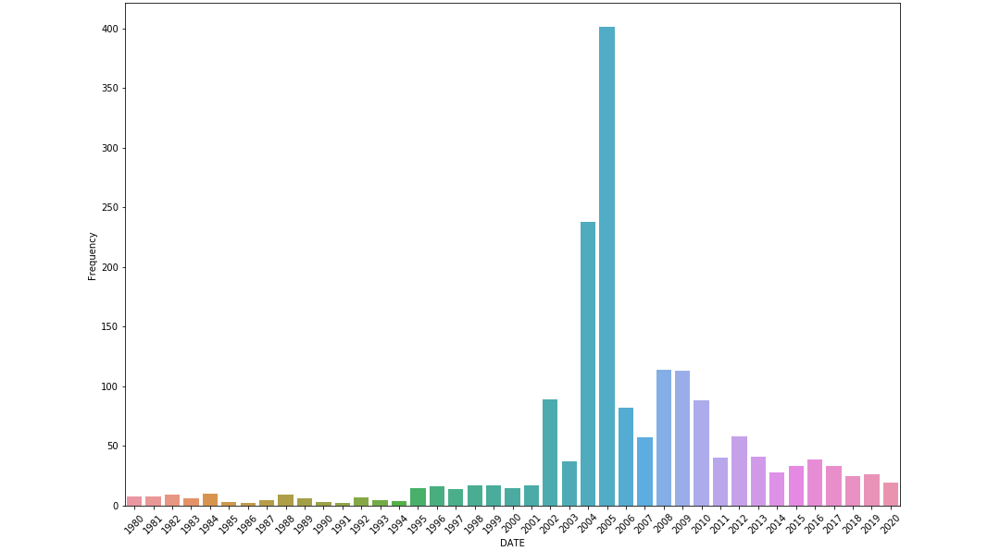

**Seismic Hazard**

All of the Andaman & Nicobar Islands lie in Zone V. The entire island chain is also susceptible to tsunamis both from large local quakes and also from massive distant shocks. No warning system is presently in place for any of the islands in this chain.  Since the earthquake database in India is still incomplete, especially with regards to earthquakes prior to the historical period (before 1800 A.D.), these zones offer a rough guide of the earthquake hazard in any particular region and need to be regularly updated (See also: GSHAP Hazard map for the Andaman Islands & the Nicobar Islands).

**Largest Instrumented Earthquake in the Andaman & Nicobar Islands**

> 26 December 2004 - Sumatra-Andaman Earthquake, $Mw 9.1; 03.298 N, 95.778 E, D=010.0 kms, OT=00:58:50 UTC$

 A "very great" earthquake struck the North Indian Ocean & the Bay of Bengal at 00:58 UTC on 26 December 2004. 2,30,210 people were are estimated to have been killed in the Indian Ocean-wide tsunami generated by this earthquake. The Nicobar Islands, and to a lesser extent the Andaman Islands, were hardest hit territory in India with as many as 4,486 deaths. Extensive damage occurred in the Nicobar Islands due to the tsunami that is estimated to have attained heights of as much as 20-metres at places.

It is clear from the data analysed that majority of the eathquakes in the Andaman region have been Minor quakes or Light earthquakes with very few Strong earthquakes recorded. The major quakes occured on the region during 2004, 2005, 2006 and 2010, some with magnitudes much higher than 6.0, and they were also followed by several minor aftershocks which is evident from the spike in the annual frequency districution curve in years 2004 and 2005. 

\pagebreak

## Answer 3-

The b-value estimation for the defined study area has been carried out using zmap7 software and MATLAB. The data was obtained from the ISC catalogue online bulletin [@international2001line] for the Region mentioned in Answer 2. The following Map of events was obtained for the given data. - 

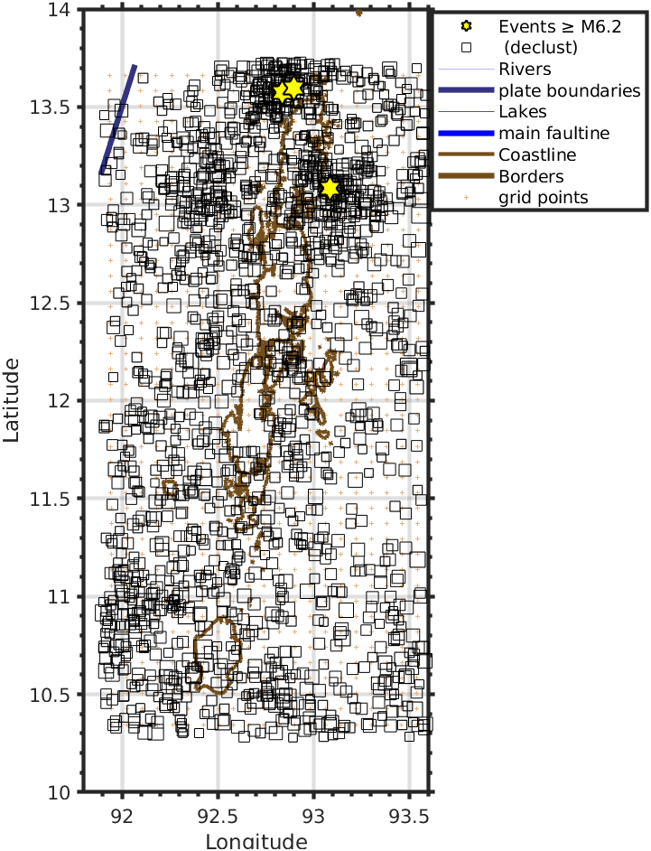

**Declustering of the Earthquake catalogue**

In order to analyze the expected anomalies in the spatial and temporal distribution of the seismic activity, the catalogs were declustered to remove “dependent” events.  In our hazard analyses, we are interested in modeling a process where each possible event is independent of any other. Foreshocks and aftershocks are both temporally and spatially dependent on the mainshock. When we speak of declustering, we mean removing these dependent events. Declustering an earthquake catalog results in a catalog composed of independent events. Here Reasenberg’s decluster method [@reasenberg1985second] for aftershock identification was applied. In this method, events within time and distance windows are associated to form clusters and the cluster is replaced with an equivalent earthquake. Any earthquake that occurs within the interaction zone of a prior mainshock is classified as an aftershock and considered as a dependent event. Several parameters have to be chosen for the declustering procedure. A detailed description is given in Ref. [@reasenberg1985second] and in the ZMAP program manual [@wiemer2001software]

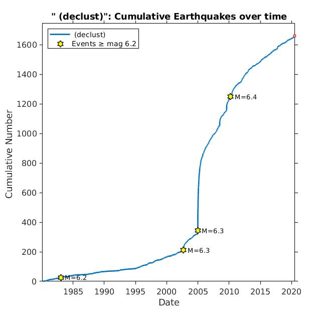 

The *b-value* estimation and value of the Magnitude of Completion i.e. $M_c$ was done using the Maximum Likelihood method.

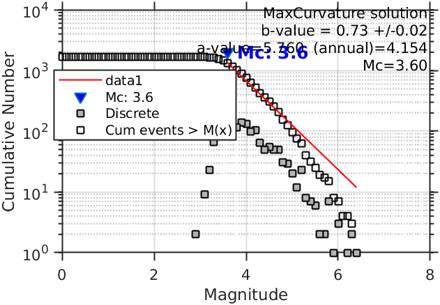

The *b-value* thus obtained here is $0.73 \pm 0.02$ and the value of $M_c$ is 3.6 from the declusterd ISC catalogue.

An assessment of the minimum magnitude of complete recording, the so-called threshold magnitude, $M_c$ , is an important part of data quality control. $M_c$ is defined as the lowest magnitude for which all events in a studied space-time volume are detected. $M_c$ varies with space and time. For most catalogs it decreases with time, because the number of monitoring seismographs continuously increases and the analysis methods improve [@wiemer2000minimum]. 

An assessment of the minimum magnitude of complete recording, the so-called threshold magnitude, $M_c$ , is an important part of data quality control. $M_c$ is defined as the lowest magnitude for which all events in a studied space-time volume are detected. $M_c$ varies with space and time. For most catalogs it decreases with time, because the number of monitoring seismographs continuously increases and the analysis methods improve [@wiemer2000minimum]. The magnitude of completeness of the declustered catalogs was determined by the Best Combination method in the ZMAP software. Figure 11 on page 13 shows the variation of $M_c$ as a function of time and as expected the minimum threshold is decreasing with time as detected events has significantly increased over the years.

**P.T.O.**

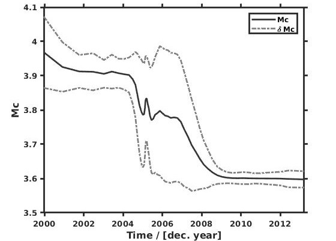

THe figure 12 on page 14 shows the magnitude -frequency distribution as a function of spatial position which has been mapped by projecting earthquake epicenters on a plane. The *b-value* has been estimated at every node of the plane grid. using the N (N = constant) nearest earthquakes, or a varying number of events located within a chosen (constant) distance, R, from the node. When N is constant, it is usually in the range of 50-500 events, and the nodal separation is $0.1^o$ - $1^o$, depending on the density of epicenters. To visualize the variation, b-values are translated into a color code and plotted for each grid node. [@article]

From the bval grid it is clear that Andaman-Nicobar region can be broadly categorised into two seismic zones, one in the norhtern andaman and the second, southern andaman region. The southern andaman region has very low *b-value*, whereas, the northern region which has high *b-values*. We know that higher *b-values* mean a greater proportion of low magnitude earthquakes to higher magnitude earthquakes and vice-versa for lower values of the constant $b$. Hence we can say that, 

- High *b-values* $\rightarrow$ low stressed region; small to moderate earthquakes,
- Low *b-values* $\rightarrow$ high stressed region; moderate to large earthquakes. 

\pagebreak

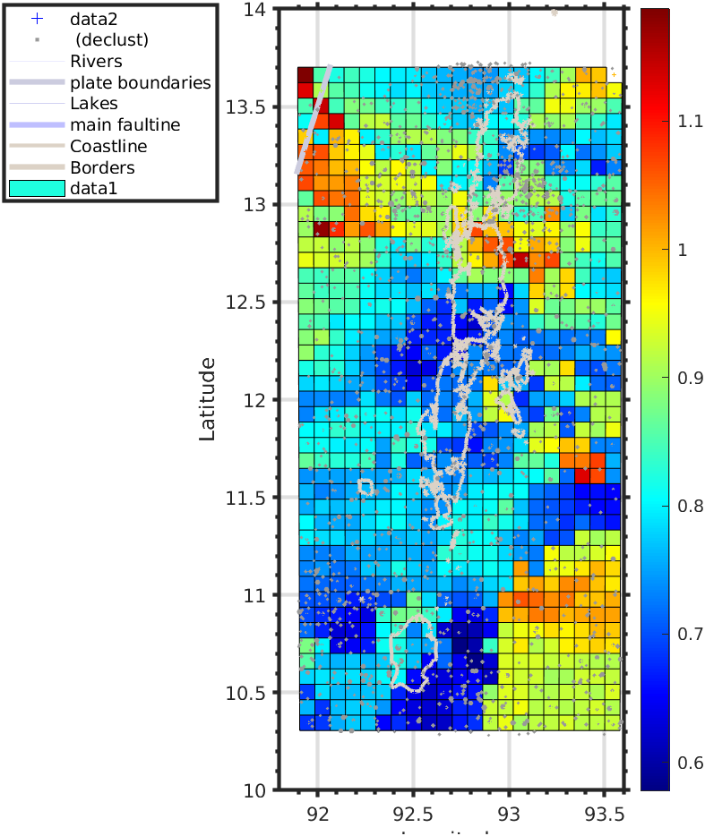

From figure 8 on page 10 and figure 12 above, we can easily say, that all major earthquake events of magnitude $\geq$ 6.20 occured in the regions/nodes of relativly low *b-values*, clearly supporting the expections from the Gutenberg-Richter Law. These regions of low *b-values* are the hazardous regions as these are the areas where a large number of the high magnitude earthquakes have occured or may occur in the near future. The regions of extremenly high *b-values* are essentially earthquake swarms of fairly low magnitude quakes.

\pagebreak

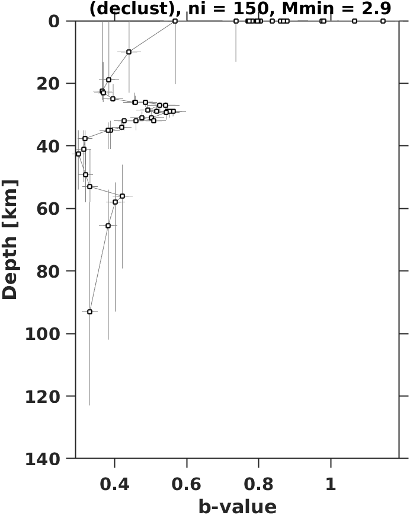

The Gutenberg–Richter b-value is thought to reflect the stress conditions in the crust; therefore, spatial and/or temporal variations of the b-value can provide important information regarding crustal tectonics. But, the variability of b with depth is often not statistically significant and that the decrease of b with depth should be interpreted with caution as shown by many research groups including Amorese et. al. [@amorese2010varying].

In this case, the variation of *b-value* with depth indicates a steady decline in the value of b with depth. There is a sharp increase in value of $b$ at $\approx 30 km.$ and $58 km.$ This indicates that the higher magnitude quakes are generally occuring at larger depths small quakes have their epicenter at/near the surface.

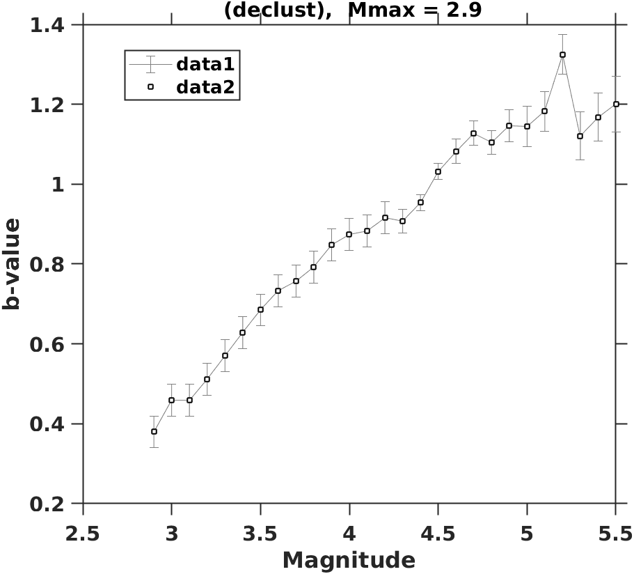

The Figure 14 above shows the variation of *b-value* of the Andaman region with the magnitude of the quakes. This is in accordance with the Gutenber-Richter law. The larger the magnitude of the quake, the larger will be the corresponding *b-value* and thus the smaller will be the correspiding cumulative frequency as seen from the following equation. 

$$N = N_{TOT} 10^{-bM}$$

The opposite is true for smaller magnitude quakes.

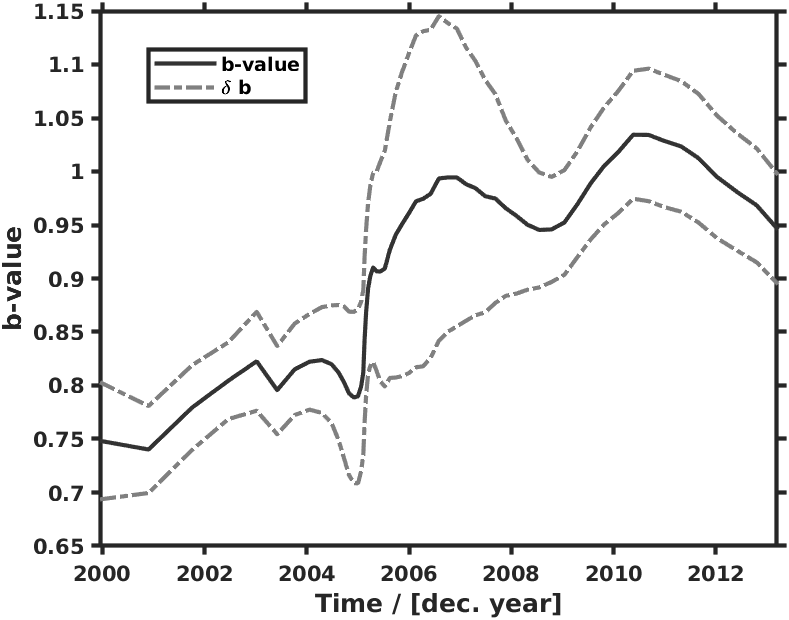

The temporal variations of the *b-values* shown in the above figure give us a great insight into the potentially hazardous regions in the greater Andaman region. We can correlate the temporal variation with the Seismic history of the region to identify the changes in *b-value* before/after major earthquake events. 

- From the figure it is clear there was a sharp decline in the *b-value* before the major quake in North Andaman in the year 2002 of moment magnitude $M_w = 6.5$ [^1]

- After this, there was a steady increase in the *b-value* with time before a sharp decrease in the value of $b$ right before the devastating Sumatra-Andaman quake in 2004 of $M_w = 9.1$

- Then there was another significant decline in *b-value* prior to the major quakes in 2005 and 2006 followed by many years of steady incline in the value of $b$.

- Then there was another sharp decline before the major quake in June, 2010 off the shore of Nicobar islands with a moment magnitude of $M_w = 7.5$ and then there was a steady rise before a another steady decline.

It is clear from these observations that there has been a steady decline in the b-value of the Andaman region before major quakes have occured and this time between the sharp decline in the *b-value* in the analysed data-set and actual occurence of the quake (also called the Precursor time) can be used to predict the time until the next major quake by using *b-values* as a precursor for predicting earthquakes of specific magnitudes depending on the decrease in *b-value* in the data gathered from the Seismology catalogues.

[^1]: Note that the magnitudes used from the ISC catalogue for analysis are body wave magnitude i.e. $M_b$

\pagebreak

# References
