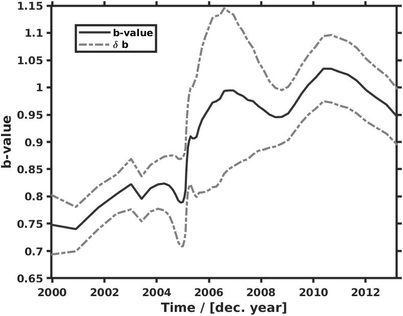

# Introduction and Background

The present study is focusing on determination of the  b-value as a function of time and space for events in the Andaman region. Earthquake data for time period 1/1/1980-13/07/2020 from the International Seismological catalogwas used. [@wiemer2001software] The frequency of earthquake occurrence in a given area during a specific period of observation can be expressed as a function of magnitude through a relation given by Gutenberg and Richter. [@gutenberg1956energy] But first we must understand the importance of b-value as a seimsological parameter. 

**b-value and its Importance**

One of the basic seismological parameters used to describe an ensemble of earthquakes is the *b-value* in the famous Gutenberg-Richter frequency magnitude relationship relationship/law. 

It charaterizes the distribution of earthquakes over the observed range of magnitudes. The *b-value* is usually 1.0, but for shorter time windows it varies significantly depending on the tectonic features of the seismically active region [@prasad2015evolution] [@pacheco1992changes]. In order to understand the concept of b-value in terms of seismology, we need to understand the Guteneberg Richter law and its significance -

**Gutenberg-Richter Law ~**

> In seismology, the Gutenberg–Richter law (GR law) expresses the relationship between the magnitude and total number of earthquakes in any given region and time period of at least that magnitude. [@gutenberg1956energy]

The corresponding Gutenberg-Richter Frequency Magnitude Relation is given by, 

$$\log_{10}{N} = a - bM$$

Or

$$N = 10^{a - bM}$$

Where, $N$ is the number of events having a magnitude $\geq M$, also called the cumulative Frequency, and $a$ and $b$ are constants which are always same for a given value of $N$ and $M$.

The significance of the GR law lies in the values of these constants. The relationship between earthquake magnitude and frequency is fairly common, but the values of $a$ and $b$ vary significantly from region to region giving seismologists significant amount of information regarding the seismo-tectonics/geo-tectonics of the region under study. When we say that the parameter $b$ i.e. the *b-value* is close to the value 1.0 (in seismically active regions)we mean to say that for a given frequency say 4.0 or larger events there will be 10 times as many magnitude 3.0 or larger quakes and also 100 times as many magnitude 2.0 or larger quakes. But the *b-value* can vary significantly from 0.5 to 2.0 or even higher depending upon on the region's seismic activity. A good example of this is Earthquake swarms which can have a *b-value* as high as 2.5 which indicates a high proportion of small quakes to large ones.

The GR Law and specifically the measurement and interpretation of the spatial and temporal variations in *b-values* can provide significant information about the evolution of the seismicity of the region under study. By analysing anomalies in the spatio-temporal variation in the *b-value* of a region with respect to major quakes we can obtain spatio-temporal constraints that can used to create, modify and/or improve earthquake forecasting models for that particular region as done by Nuannin et. al. [@nuannin2005spatial] for the Andaman-Sumatra region.

Now, the ***a-value*** represents the total seismicity rate of the region. This is more easily seen when the GR law is expressed in terms of the total number of events: 

$$N = N_{TOT}10^{-bM}$$

where $N_{TOT} = 10^a$, is the total number of events. Also it is interesting to note that since $10^a$ is the total number of events, $10^{-bM}$ is the probablity of those events.

This is the importance of b-value and the GR law as seismological Parameters.

# Objective

The main objective of the report is to do hazard estimation using the b-value obtained from the Frequency-Magnitude distribution curve and infer the Geological implications of the b-value estimated from the said FMD-curve as well as infer about the stress and heterogeneity of the region using the spatio-temporal ditribution of b-value and its variation with depth.

# Methodology

**b-value estimation and Spatio-temporal variation.**

The b-value estimation for the defined study area has been carried out using zmap7 software and MATLAB. The data was obtained from the ISC catalogue online bulletin [@international2001line]. The following Map of events was obtained for the given data. - 

{width=300px height=300px}

**Declustering of the Earthquake catalogue**

In order to analyze the expected anomalies in the spatial and temporal distribution of the seismic activity, the catalogs were declustered to remove “dependent” events.  In our hazard analyses, we are interested in modeling a process where each possible event is independent of any other. Foreshocks and aftershocks are both temporally and spatially dependent on the mainshock. When we speak of declustering, we mean removing these dependent events. Declustering an earthquake catalog results in a catalog composed of independent events. Here Reasenberg’s decluster method [@reasenberg1985second] for aftershock identification was applied. In this method, events within time and distance windows are associated to form clusters and the cluster is replaced with an equivalent earthquake. Any earthquake that occurs within the interaction zone of a prior mainshock is classified as an aftershock and considered as a dependent event. Several parameters have to be chosen for the declustering procedure. A detailed description is given in Ref. [@reasenberg1985second] and in the ZMAP program manual [@wiemer2001software]

{width=300px height=300px}

The *b-value* estimation and value of the Magnitude of Completion i.e. $M_c$ was done using the Maximum Likelihood method.

{width=300px height=300px}

The *b-value* thus obtained here is $0.73 \pm 0.02$ and the value of $M_c$ is 3.6 from the declusterd ISC catalogue.

An assessment of the minimum magnitude of complete recording, the so-called threshold magnitude, $M_c$ , is an important part of data quality control. $M_c$ is defined as the lowest magnitude for which all events in a studied space-time volume are detected. $M_c$ varies with space and time. For most catalogs it decreases with time, because the number of monitoring seismographs continuously increases and the analysis methods improve [@wiemer2000minimum]. The magnitude of completeness of the declustered catalogs was determined by the Best Combination method in the ZMAP software. Figure 4 on 13 shows the variation of $M_c$ as a function of time and as expected the minimum threshold is decreasing with time as detected events has significantly increased over the years.

{width=300px height=300px}

THe figure 3 shows the magnitude -frequency distribution as a function of spatial position which has been mapped by projecting earthquake epicenters on a plane. The *b-value* has been estimated at every node of the plane grid. using the N (N = constant) nearest earthquakes, or a varying number of events located within a chosen (constant) distance, R, from the node. When N is constant, it is usually in the range of 50-500 events, and the nodal separation is $0.1^o$ - $1^o$, depending on the density of epicenters. To visualize the variation, b-values are translated into a color code and plotted for each grid node. [@article]

From the bval grid it is clear that Andaman-Nicobar region can be broadly categorised into two seismic zones, one in the norhtern andaman and the second, southern andaman region. The southern andaman region has very low *b-value*, whereas, the northern region which has high *b-values*. We know that higher *b-values* mean a greater proportion of low magnitude earthquakes to higher magnitude earthquakes and vice-versa for lower values of the constant $b$. Hence we can say that, 

- High *b-values* $\rightarrow$ low stressed region; small to moderate earthquakes,
- Low *b-values* $\rightarrow$ high stressed region; moderate to large earthquakes. 

# Main Findings

{width=300px height=300px}

From figure 1 and figure 5 above, we can easily say, that all major earthquake events of magnitude $\geq$ 6.20 occured in the regions/nodes of relativly low *b-values*, clearly supporting the expections from the Gutenberg-Richter Law. These regions of low *b-values* are the hazardous regions as these are the areas where a large number of the high magnitude earthquakes have occured or may occur in the near future. The regions of extremenly high *b-values* are essentially earthquake swarms of fairly low magnitude quakes.

{width=300px height=300px}

The Gutenberg–Richter b-value is thought to reflect the stress conditions in the crust; therefore, spatial and/or temporal variations of the b-value can provide important information regarding crustal tectonics. But, the variability of b with depth is often not statistically significant and that the decrease of b with depth should be interpreted with caution as shown by many research groups including Amorese et. al. [@amorese2010varying].

In this case, the variation of *b-value* with depth indicates a steady decline in the value of b with depth. There is a sharp increase in value of $b$ at $\approx 30 km.$ and $58 km.$ This indicates that the higher magnitude quakes are generally occuring at larger depths small quakes have their epicenter at/near the surface. These variations with depth indicate the stress among the earth's surface layers in those depths. The depths at which b-value is high, are less stressed regions, whereas the opposite is true for depths with higher b-values and hence there are gerater chances of high magnitude earthquakes to have epicenters in these depths.

{width=300px height=300px}

The Figure 7 above shows the variation of *b-value* of the Andaman region with the magnitude of the quakes. This is in accordance with the Gutenber-Richter law. The larger the magnitude of the quake, the larger will be the corresponding *b-value* and thus the smaller will be the correspiding cumulative frequency as seen from the following equation. 

$$N = N_{TOT} 10^{-bM}$$

The opposite is true for smaller magnitude quakes.

{width=300px height=300px}

The temporal variations of the *b-values* shown in the above figure give us a great insight into the potentially hazardous regions in the greater Andaman region. We can correlate the temporal variation with the Seismic history of the region to identify the changes in *b-value* before/after major earthquake events. 

- From the figure it is clear there was a sharp decline in the *b-value* before the major quake in North Andaman in the year 2002 of moment magnitude $M_w = 6.5$ [^1]

- After this, there was a steady increase in the *b-value* with time before a sharp decrease in the value of $b$ right before the devastating Sumatra-Andaman quake in 2004 of $M_w = 9.1$

- Then there was another significant decline in *b-value* prior to the major quakes in 2005 and 2006 followed by many years of steady incline in the value of $b$.

- Then there was another sharp decline before the major quake in June, 2010 off the shore of Nicobar islands with a moment magnitude of $M_w = 7.5$ and then there was a steady rise before a another steady decline.

It is clear from these observations that there has been a steady decline in the b-value of the Andaman region before major quakes have occured and this time between the sharp decline in the *b-value* in the analysed data-set and actual occurence of the quake (also called the Precursor time) can be used to predict the time until the next major quake by using *b-values* as a precursor for predicting earthquakes of specific magnitudes depending on the decrease in *b-value* in the data gathered from the Seismology catalogues.

[^1]: Note that the magnitudes used from the ISC catalogue for analysis are body wave magnitude i.e. $M_b$

**The two Seismic Zones -**

The Northern seismic zone was chosen from 14 deg. latitude to 12 deg. and the following spatial variation of b-value and FMD was obtained.

{width=300px height=300px}\ {width=300px height=300px}

The overall b-value of the Norhthern seismic zone is higher than that of the entire Andaman region indicating that it is a relatively low stress region and is less prone to hazard in the near future. The Southern seismic zone was chosen from 12 deg. latitude to 10 deg. and the following spatial variation of b-value and FMD was obtained.

{width=300px height=300px}\ {width=300px height=300px}

The overall b-value of the Southern seismic zone is lower than that of the entire Andaman region and also lower than the Northern region indicating that it is a relatively high stress region and is more prone to hazard in the near future.

# Conclusion 
b-values characterizing the spatial and temporal variation of seismicity in the Andaman region during a span of 40 years were calculated using earthquake data from the ISC catalogue. Data from the catalog have been carefully selected and analyzed. Completeness of the catalogs is an important parameter that has to be taken into consideration in the determination of b. The results have been obtained - 

- The b-value of the entire Andaman region was found to be 0.73 $\pm$ 0.02 with $M_c = 0.36$
- The b-value of the Northern seismic zone of Andaman region was found to be 0.76 $\pm$ 0.02 with $M_c = 0.36$
- The b-value of the entire Andaman region was found to be 0.69 $\pm$ 0.02 with $M_c = 0.36$
- The temporal and spatial variations of b-value were analysed and it was tested against the Seismic History of the region to check for the years in which major quakes happened and it was found that before each major quake, there was a gradual drop in the b-value.
- The b-value variation with depth was analysed and the depth at which the stress is maximum was determined.

# Future perspectives

Frequency magnitude distribution curve and spatial and temporal variations of b-value can be used as a precursor to exisiting seismic history of a region to loosely predict the time and magnitude of future quakes. The study has been carried out by several research groups including Smith et. al. [@smith1981b] and Nuannin et. al. [@nuannin2012study]. The $b(t)$ variation can be used as a precursor to model to existing data on major quakes to obtain precursor times for each quake. These precursor times can be plotted and the data can be extrapolated to obtain the time duration between the last major quake and next major quake. This particular application isn't always accurate in prediction, however modifications can be made to check the validity of this method and improve the accuracy.

# References
