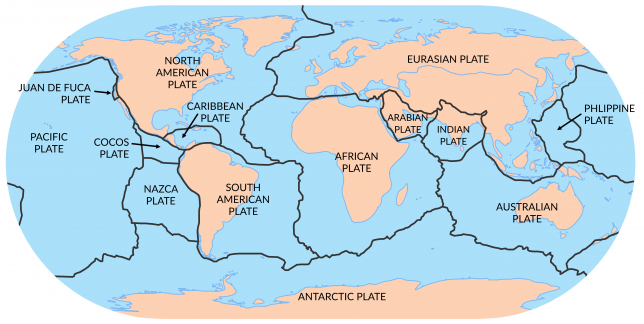
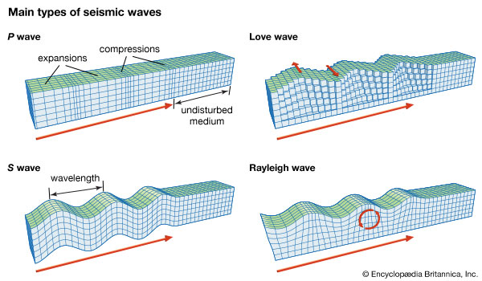
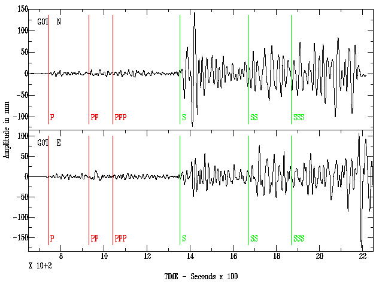
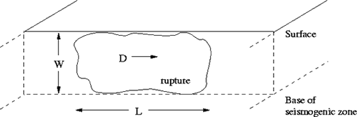

# Introduction 

Earthquakes is the shaking of the surface of the Earth resulting from a sudden release of energy in the Earth's lithosphere that creates seismic waves. Such earthquakes can range in various sizes from those that are so weak that cannot even be felt to those that are violent enough to cause mass destruction across cities. An important concept often discussed in relation to earthquakes is **seismicity**, or seismic activity, of an area which is the frequency, type and size of the earthquakes experienced over a period of time.[@ohnaka2013physics]

At or near the Earth's surface, earthquakes occur due to the shaking, displacement or disruption of the ground, generally due to natural phenomena (major example being the movement or collision of tectonic plates well below the crust) or sometimes even due to man-made phenomena. Strain in the Earth’s crust accumulates as plates shift and grind past one another. Strain cannot build indefinitely and is released when the strength of the crustal rocks is exceeded. This sudden release of elastic energy causes an earthquake. The elastic energy is released in the form of heat and elastic waves. The movement of these waves through the Earth’s crust is felt during an earthquake. 

This can lead to severe land-based destruction and even lead to other events such as severe landslides and even volcanic activity at active sites. But when the epicenter of the large earthquake is located offshore, it gives rise to other disastrous events such as a tsunami causes by the displacement of the seabed.

In its most general sense, the word earthquake is used to describe any seismic event—whether natural or caused by humans—that generates seismic waves. Earthquakes are caused mostly by rupture of geological faults but also by other events such as volcanic activity, landslides, mine blasts, and nuclear tests. An earthquake's point of initial rupture is called its hypocenter or focus. The epicenter is the point at ground level directly above the hypocenter.[@ohnaka2013physics]

Clearly the phenomena of earthquake can be incredibly dangerous and can adversely affect day-to-day human life and as a result, it is imperative for the scientific community to measure the intensity at which these quakes and shimmers occur, (especially at highly active sites where tremors and quakes are a regular phenomenon) to gather signoficant amount of data to make better prediction for future possibilities of quakes. The data gathered helps geologists to map the fault lines in the region and to gain a better idea of the tectonic movements in that region. In addition to this, earthquake magnitude data can also provide significant information to help predict whether the source of such quakes or tremors is strictly natural, man-made or perhaps a combination of both.[@william1989measuring] [@wyss1978estimating]

# Seismic Waves : What the instruments measure during an Earthquake

Seismic waves are waves of energy that travel through the Earth's layers, and are a result of earthquakes, volcanic eruptions, magma movement, large landslides and large man-made explosions that give out low-frequency acoustic energy. Many other natural and anthropogenic sources create low-amplitude waves commonly referred to as ambient vibrations. Seismic waves are studied by geophysicists called seismologists. Seismic wave fields are recorded by a seismometer, hydrophone (in water), or accelerometer.[@helffrich2001earth] 

There are mainly two types of seismic waves: body waves which travel through the body of the earth and surface waves which travel around the surface of the earth. Body waves can be characterized as either primary or secondary. The primary or P wave (as shown in Figure 2) is the fastest (~5.5  km/sec  in  granite) [@bolt1993earthquakes] of the body waves and is the first wave recorded on a seismograph. The P wave can travel through both solid and liquid material. P wave motion is similar to that of a sound wave in its push-pull (compression-dilation) motion. The secondary or S wave travels more slowly (~3.0  km/sec  in granite) [@bolt1993earthquakes] than the P wave. The S wave travels only through solid material and its movement is similar to light waves in that it moves perpendicular to the direction of motion as it propagates. 

Surface waves travel more slowly than bodywaves [@bolt1993earthquakes] and usually cause the most destruction. Love and Rayleigh waves are two types of surface waves. Generally speaking, Love waves travel faster than Rayleigh waves with horizontal shear motion perpendicular to the direction of propagation while the motion of a Rayleigh wave is in a vertical plane parallel to the direction of wave propagation.[@ota1990anatomy]

# Earthquake Magnitude Scales

## Evolution

Quaking or shaking of the earth is a common phenomenon. Prior to the development of strong-motion accelerometers that can measure peak ground speed and acceleration directly, the intensity of the earth-shaking was estimated on the basis of the observed effects, as categorized on various **seismic intensity scales**, which categorise the intensity of the ground shaking at a given location on the basis of the observed effects of the earthquake, for eg., the exent of the damage caused to the different kinds of structures or natural features. **The concept of seismic intensity scales is quite different from the more technical concept of seismic magnitude scales**, which measure the magnitude or overall strength of an earthquake, which may, or perhaps not, cause perceptible shaking. This intensity of shaking depends on several factors:

- The "size" or strength of the source event, such as measured by various seismic magnitude scales;
- The type of seismic wave generated, and its orientation;
- The depth of the event;
- The distance from the source event;
- Site response^[Site response is especially important as certain conditions, such as unconsolidated sediments in a basin, can amplify ground motions as much as ten times. ] due to local geology.

Only in the last century has the source of such shaking been identified as ruptures in the Earth's crust, with the intensity of shaking at any locality dependent not only on the local ground conditions but also on the strength or magnitude of the rupture, and on its distance[@bolt1993earthquakes]. Subsequently, the first scale for measuring earthquake magnitudes was developed by Charles F. Richter in 1935. Subsequent scales have retained a key feature, where each unit represents a ten-fold difference in the amplitude of the ground shaking and a 32-fold difference in energy. Subsequent scales are also adjusted to have approximately the same numeric value within the limits of the scale.[@chung1981regional]

## Seismic Magnitude Scales

The **magnitude** is a number that characterizes the relative size of an earthquake. Magnitude is based on measurement of the maximum motion recorded by a seismograph. Several scales have been defined, but the most commonly used are:
- Local Magnitude (ML), commonly referred to as "Richter magnitude", 
- surface-wave Magnitude (Ms), 
- body-wave Magnitude (Mb), and 
- moment magnitude (Mw). 

The first three Scales have limited range and applicability and do not satisfactorily measure the size of the largest earthquakes. The moment magnitude (Mw) scale, based on the concept of seismic moment, is uniformly applicable to all sizes of earthquakes but is more difficult to compute than the other types. All magnitude scales should yield approximately the same value for any given earthquake.

Magnitude is expressed in whole numbers and decimal fractions. For example, a magnitude 5.3 is a moderate earthquake, and a 6.3 is a strong earthquake. Because of the logarithmic basis of the scale, each whole number increase in magnitude represents a tenfold increase in measured amplitude as measured on a seismogram. When initially developed, all magnitude scales based on measurements of the recorded waveform amplitudes were thought to be equivalent. But for very large earthquakes, some magnitudes underestimate true earthquake size, and some underestimate the size. Thus, we now use measurements that describe the physical effects of an earthquake (in other words, the **seismic intensity scale** discusses before) rather than measurements based only on the amplitude of a waveform recording.

In general the Logarithmic Magnitude scale for magnitude is given by-

$$M = \log_{10}{\frac{A}{T}} + F(h, \Delta) + C$$

where, **$A$** is the amplitude of the signal, **$T$** is its dominant period, **$F$** is a correction for the variation of amplitude with the earthquake’s depth **$h$** and angular distance **$\Delta$** from the seismometer, and **$C$** is a regional scaling factor.

The following are the major types of Earthquake magnitude scales-

### Richter Magnitude Scale

The first scale for measuring earthquake magnitudes, developed in 1935 by Charles F. Richter and popularly known as the "Richter" scale, is actually the Local magnitude scale, label ML or $M_{L}$[@kanamori1983magnitude]. Richter established two features now common to all magnitude scales. First, the scale is logarithmic, so that each unit represents a ten-fold increase in the amplitude of the seismic waves.[@richter1935instrumental] As the energy of a wave is 101.5 times its amplitude, each unit of magnitude represents a nearly 32-fold increase in the seismic energy (strength) of an earthquake. 

Second, Richter arbitrarily defined the zero point of the scale to be where an earthquake at a distance of 100 km makes a maximum horizontal displacement of 0.001 millimeters (1 µm, or 0.00004 in.) on a seismogram recorded with a Wood-Anderson torsion seismograph. Subsequent magnitude scales are calibrated to be approximately in accord with the original "Richter" (local) scale around magnitude 6.[@kanamori1983magnitude] [@richter1935instrumental]

> All "Local" (ML) magnitudes are based on the maximum amplitude of the ground shaking, without distinguishing the different seismic waves. They underestimate the strength: 

- of distant earthquakes (over ~600 km) because of attenuation of the S-waves,
- of deep earthquakes because the surface waves are smaller, and
- of strong earthquakes (over M ~7) because they do not take into account the duration of shaking.

The original "Richter" scale, developed in the geological context of Southern California and Nevada, was later found to be inaccurate for earthquakes in the central and eastern parts of the continent (everywhere east of the Rocky Mountains) because of differences in the continental crust.[@bernreuter1980development] All these problems prompted the development of other scales. However, local magnitudes are sometimes still reported,because many buildings have resonant frequencies near 1 Hz. Therefore, $M_{L}$ is often a good indicator of the potential for structural damage.

For the region of Souther California the value of this magnitude scale is given as-

$$M_{L} = \log_{10}{A} + 2.76\log_{10}{\Delta} - 2.48$$

### Body-wave Magnitude Scales

**mB scale**

Body-waves consist of P-waves that are the first to arrive (see seismogram), or S-waves, or reflections of either. Body-waves travel through rock directly.[@havskov2008processing]

The original "body-wave magnitude" – mB or $m_{B}$ was developed by Gutenberg and Gutenberg & Richter [@havskov2008processing] to overcome the distance and magnitude limitations of the ML  scale inherent in the use of surface waves. mB  is based on the P- and S-waves, measured over a longer period, and does not saturate until around M 8. However, it is not sensitive to events smaller than about M 5.5.

**mb scale**

The mb or $m_b$ scale is similar to mB , but uses only P-waves measured in the first few seconds on a specific model of short-period seismograph.[@kanamori1983magnitude] [@bernreuter1980development] It was introduced in the 1960s with the establishment of the World-Wide Standardized Seismograph Network (WWSSN); the short period improves detection of smaller events, and better discriminates between tectonic earthquakes and underground nuclear explosions.

$$m_b = \log_{10}{\frac{A}{T}} + Q(h,\Delta)$$

In this case, $A$ is the ground motion amplitude in microns after the effects of the seismometer are removed, $T$ is the wave period in seconds, and $Q$ is an empirical term that is a function of angular distance and focal depth and it be derived as a global average or for a specific region.

### Surface-wave magnitude scales

Surface waves propagate along the Earth's surface, and are principally either Rayleigh waves or Love waves.[38] For shallow earthquakes the surface waves carry most of the energy of the earthquake, and are the most destructive. Deeper earthquakes, having less interaction with the surface, produce weaker surface waves.[@havskov2008processing] 

The surface-wave magnitude scale, variously denoted as Ms, MS, and $M_s$, is based on a procedure developed by Beno Gutenberg in 1942 [@gutenberg1945amplitudes] for measuring shallow earthquakes stronger or more distant than Richter's original scale could handle. Notably, it measured the amplitude of surface waves (which generally produce the largest amplitudes) for a period of "about 20 seconds". The Ms  scale approximately agrees with ML  at ~6, then diverges by as much as half a magnitude.[@kanamori1983magnitude]

The original scale developed by Gutenberd (1945) is given by-

$$M_s = \log_{10}{A} + 1.656\log_{10}{\Delta} + 1.818$$

Where $A$ is the horizontal component of the maximum ground displacement (in microns) due to the surface waves with periods of 20 s.

A modification – the "Moscow-Prague formula" – was proposed in 1962, and recommended by the **International Association for Seismology and Physics of the Earth’s Interior (IASPEI)** in 1967; this is the basis of the standardized $M_{s20}$ scale

$$M_{s20} = \log_{10}{ \left( \frac{A}{T} \right)_{max}} + 1.66\log_{10}{\Delta} + 3.3$$

Where the $\left( \frac{A}{T} \right)_{max}$ is the maximum of all the $\frac{A}{T}$ values of the wave group on a record.

If Rayleigh waves with a period of 20s are used, which often have the largest amplitudes, the above expression reduces to

$$M_{s20} = \log_{10}{A_{20}} + 1.66\log_{10}{\Delta} + 2.0$$

Where $A$ is still the ground motion amplitude in microns after the effects of the seismometer have been removed.

**Limitation of the traditional Magnitude scales-**

- As measures of earthquake size, magnitudes have twomajor advantages. First, they are directly measured from seismograms without sophisticated signal processing.Second, the estimates they yield are intuitively meaningful(magnitude 5 is moderate, magnitude 6 is strong etc.). But, they are totally empirical, and thus have no direct connection to the physics of the earthquake. Thes equations used are not even dimensionally correct $\frac{A}{T}$ is not dimensionless, yet the logarithm of this quantity is still taken).

- A second problem is with consistency; magnitude estimates vary noticeably with azimuth, due partly to the source radiation pattern.

- Different magnitude scales also yield different values, and body and surface wave magnitudes do not correctly reflect the size of large earthquakes.

- Earthquake magnitudes and moment Limitations - The earthquakes with moments greater than the San Fernando earthquake all have mb = 6.2, even as the moment increases by a factor of 20,000. Similarly, the earthquakes larger than the San Francisco earthquake have Ms $\approx$ 8.3, even as the moment increasesby a factor of 400. This effect, called magnitude saturation, is a general phenomenon for approximately mb > 6.2 and Ms > 8.3.

 Due to these limitations and many other issues, the concept of Moment Magnitude was introduced.

### Moment magnitude scale

Other magnitude scales are based on aspects of seismic waves that only indirectly and incompletely reflect the force of an earthquake, involve other factors, and are generally limited in some respect of magnitude, focal depth, or distance. The moment magnitude scale – Mw or $M_{w}$ – developed by Kanamori [@kanamori1977energy] and Hanks & Kanamori (1979), is based on an earthquake's seismic moment, $M_0$, a measure of how much work an earthquake does in sliding one patch of rock past another patch of rock.

$$M_0 = rigidity \times area \times slip$$

Where slip is the relative displacement of formerly adjecent points on opposite sides of a fault measured on the fault surface, rigidity is the strength of the rock along the fault, and area is the area of the fault that slipped. Thus, stronger rock material, or a larger area, or more movement in an earthquake will all contribute to produce a larger magnitude.

Then, 

$$M_w = \left( \frac{2}{3} \right) \log_{10}{M_0} - 2.7$$

Where $M_w$ is the Moment Magnitude.

### Others

- Energy Release

Another way to measure the size of an earthquake is to compute how much energy it released. The amount of energy radiated by an earthquake is a measure of the potential for damage to man-made structures. An earthquake releases energy at many frequencies, and in order to compute an accurate value, you have to include all frequencies of shaking for the entire event.

While each whole number increase in magnitude represents a tenfold increase in the measured amplitude, it represents an 32 times more energy release.

The energy can be converted into yet another magnitude type called the Energy Magnitude (Me). However, since the Energy Magnitude and Moment Magnitude measure two different properties of the earthquake, their values are not the same.

The energy release can also be roughly estimated by converting the moment magnitude to energy using the equation $\log_{10}{E} = 5.24 + 1.44 \times M$, where M is the magnitude.

- Intensity

Whereas the magnitude of an earthquake is one value that describes the size, there are many intensity values for each earthquake that are distributed across the geographic area around the earthquake epicenter. The intensity is the measure of shaking at each location, and this varies from place to place, depending mostly on the distance from the fault rupture area. However, there are many more aspects of the earthquake and the ground it shakes that affect the intensity at each location, such as what direction the earthquake ruptured, and what type of surface geology is directly beneath you. Intensities are expressed in Roman numerals, for example, VI, X, etc.

Traditionally the intensity is a subjective measure derived from human observations and reports of felt shaking and damage. The data used to be gathered from postal questionnaires, but with the advent of the internet, it's now collected using a web-based form. However, instrumental data at each station location can be used to calculate an estimated intensity.

# Conclusion

The measurment of the magnitude of Earthquakes has evolved a lot through the years with geologists finding out more about the earth's fault lines and tectonic movements leading to better analysis of existing data to create much better models. This evolution has seen the transition from traditional magnitude scales to the modern moment magnitude scale and also to the more qualitative classification of damage caused by earthquakes using the seismic intentsity scale. 

# References
